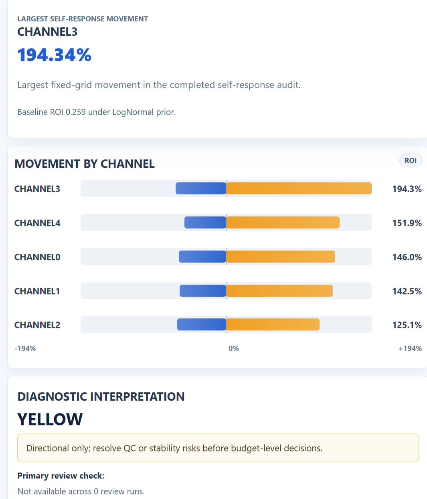

<a id="readme-top"></a>

<h1 align="center">Prior Sensitivity Analysis for MMMs</h1>


<!-- TABLE OF CONTENTS -->
<!-- TABLE OF CONTENTS -->
<details>
  <summary>Table of Contents</summary>

  <ol>
    <li>
      <a href="#about-the-project">About The Project</a>
    </li>
    <li>
      <a href="#getting-started">Getting Started</a>
    </li>
    <li><a href="#quick-start">Quick Start</a></li>
    <li><a href="#how-to-use">How to Use</a></li>
    <li><a href="#data-requirements">Data Requirements</a></li>
    <li><a href="#outputs">Outputs</a></li>
    <li><a href="#project-structure">Project Structure</a></li>
    <li><a href="#license">License</a></li>
    <li><a href="#contact">Contact</a></li>
    <li><a href="#acknowledgments">Acknowledgments</a></li>

  </ol>
</details>


<!-- ABOUT THE PROJECT -->
## About The Project

<p align="center">
  
</p>

This project was developed during a data science capstone internship at Blue Alpha in collaboration with UCSB and focuses on building a prior sensitivity analysis framework for Marketing Mix Modeling (MMM).

Modern MMMs rely heavily on priors, especially in highly correlated low data advertising environments. 

This project is built on top of Google Meridian a MMM designed to measure media effectiveness, estimate ROI, and support marketing budget allocation. The pipeline systematically tests different prior configurations and measures how MMM outputs change in response. The system automates large scale prior grids and generates sensitivity reports, robustness metrics, and tornado graphs. 


<p align="right">(<a href="#readme-top">back to top</a>)</p>


### Built With

* [![TensorFlow][TensorFlow.js]][Tensorflow-url]
* [![React][React.js]][React-url]
* [![FastAPI][FastAPI.js]][FastAPI-url]
* [![Matplotlib][Matplotlib.js]][Matplotlib-url]
* [![Pandas][Pandas.js]][Pandas-url]
* [![NumPy][NumPy.js]][NumPy-url]
* [Google Meridian](https://developers.google.com/meridian)
* [Jinja2](https://jinja.palletsprojects.com/)


<p align="right">(<a href="#readme-top">back to top</a>)</p>


<!-- GETTING STARTED -->
## Getting Started

Before running the project, install:
- Python 3.11+
- Node.js & npm

1. Clone the repo
   ```powershell
   git clone https://github.com/github_username/bluealpha-mmm-prior-sensitivity.git
   cd bluealpha
   ```
2. Create and activate a virtual environment
   ```powershell
   python -m venv .venv
   ```
   Windows:
   ```powershell
   .venv\Scripts\activate
   ```
   Mac/Linux:
   ```sh
   source .venv/bin/activate
3. Install project dependencies
   ```powershell
   pip install -r requirements.txt
   ```
<p align="right">(<a href="#readme-top">back to top</a>)</p>

## Quick Start

1. Launch Backend 
   ```powershell
   python -m uvicorn backend.app.main:app --host 127.0.0.1 --port 8000
   ```
2. Launch Frontend 
   in a separate terminal:
   ```powershell
   cd frontend
   npm install
   npm run dev
   ```
<p align="right">(<a href="#readme-top">back to top</a>)</p>

## How to Use

To get started, you can explore sample experiments on the **Saved Results** page to understand the workflow and output structure. 

1. Upload your dataset
2. Verify that all column mappings are correct
3. Add a `revenue_per_kpi` value if applicable
4. Configure experiment settings and prior sensitivity grid
5. Select structural parameters
6. Start and monitor pipeline
7. View Results

The project uses a React web dashboard that provides a interface for configuring, launching, and monitoring prior sensitivity experiments.

Experiment Setup
Through the dashboard, users can define channel prior sentivity settings and MMM structural parameters including:
- Prior mean (`μ`)
- Prior standard deviations (`σ`)
- Prior distributions
- Target channels
- Adstock decay settings
- `alpha_m`
- `ec_m`
- `slope_m`
- `max_lag`

These setting are converting into YAML configuration files that drive the backend experiment execution.
#### Example:

```json
{
  "mode": "per_channel_custom",
  "baseline": {
    "roi_mu": 1,
    "roi_sigma": 1,
    "roi_dist": "LogNormal",
    "confirmed": true
  },
  "default_grid": {
    "mu": {
      "start": 0.5,
      "end": 5,
      "increment": 0.5,
      "count": 10
    },
    "sigma": {
      "values": [
        0.5,
        1,
        1.5
      ],
      "count": 3
    },
    "distribution": [
      "LogNormal"
    ]
  },
  "channels": {
    "amazon": {
      "status": "default"
    },
    "beehiiv": {
      "status": "default"
    },
    "google": {
      "status": "default"
    },
    "liveintent": {
      "status": "default"
    },
    "meta": {
      "status": "default"
    },
    "moloco": {
      "status": "default"
    },
    "snapchat": {
      "status": "default"
    },
    "tiktok": {
      "status": "default"
    }
  }
}
```
<p align="right">(<a href="#readme-top">back to top</a>)</p>

## Data Requirements

Input datasets should be provided as CSV files with time-series advertising data formatted for Google Meridian MMM workflows.

### Required Fields

| Field Type | Description |
|---|---|
| Time Column | Date or time index for observations |
| KPI Column | Target outcome metric (e.g. conversions, subscriptions, sales) |
| Media Spend Columns | Spend values for each advertising channel |
| Media Impression Columns | Impression or exposure metrics for each channel |

---

### Optional Fields

| Field Type | Description |
|---|---|
| revenue_per_kpi | Revenue conversion value for non-revenue KPIs 

---

### Example Dataset Schema

```text
date
subscriptions
meta_spend
meta_impressions
google_spend
google_impressions
tiktok_spend
tiktok_impressions
```

---

### Supported MMM Inputs

The pipeline supports:

- revenue KPIs
- non-revenue KPIs
- media spend inputs
- media impression inputs
<p align="right">(<a href="#readme-top">back to top</a>)</p>

## Outputs
Generated outputs are organized into: 

| Module | Description |
|---|---|
| **Overview** | High-level experiment summaries, tornado graph, and channel movement |
| **Prior Sensitivity** | Per channel robustness score, movement, and cross channel movement |
| **Prior vs Posterior** | Comparison of prior assumptions against posterior model estimates |
| **Scenario Explorer** | Interactive exploration of different experiment configurations |
| **Model Structure** | Structural parameter analysis including adstock and response curves |
| **Run Audit & Diagnostics** | QC outputs and reviewer diagnostics |

<p align="right">(<a href="#readme-top">back to top</a>)</p>

<!-- STRUCTURE -->
## Project Structure
```
project/
├── config/                         # Experiment & dashboard configuration
│   ├── sensitivity.yaml            # Prior sensitivity run config
│   └── dashboard.yaml              # Dashboard branding & thresholds
│
├── data/
│   ├── raw/                        # Input datasets
│   │
│   └── output/                     # Pipeline outputs
│       ├── 01_runs/                # Raw Meridian experiment outputs
|       |
│       ├── 02_tables/              # Aggregated sensitivity tables & tornado
│       │
│       └── 03_reports/             # Dashboard reports & visualizations
│           └── report/
│
├── src/                            # Python backend - analysis & orchestration
│   ├── main.py                     # Experiment grid orchestration
│   ├── pipeline.py                 # End-to-end execution
│   ├── run_meridian_once.py        # Single model execution
│   ├── summarize_sensitivity.py    # Aggregation & tornado generation
│   ├── run_config.py               # Config loading & validation
│   ├── io_utils.py                 # CSV handling
│   ├── output_paths.py             # Centralized path management
│   │
│   ├── reporting/                  # Dashboard & report generation
│   │   ├── metrics.py              # Sensitivity metrics
│   │   ├── figures.py              # Chart generation
│   │   └── render.py               # HTML rendering
│   │
│   └── viz/                        # Visualization utilities
│       ├── tornado_plots.py
│       └── roi_prior_vs_posterior.py
│
├── backend/                        # FastAPI backend server
│   ├── app                         # FastAPI application
│   ├── storage/                    # Data for web experiments 
│   │   ├── runs                    # Meridian experiment outputs
│   │   └── uploads                 
│   └── requirements.txt
│
├── frontend/                       # React dashboard frontend
│
├── docs/                           # Documentation & research
├── scripts/                        # Utility scripts
├── requirements.txt                # Python dependencies
├── README.md
└── LICENSE
```
<p align="right">(<a href="#readme-top">back to top</a>)</p>

<!-- LICENSE -->
## License

This project is intended for research. See `LICENSE.txt` for more information.


<!-- CONTACT -->
## Contact

Jasper Luo - [LinkedIn](https://www.linkedin.com/in/jasperluo0228/) - jasperluo0228@gmail.com
Quinlan Wilson - [LinkedIn](https://www.linkedin.com/in/quinlanwilson/) - quinlan.wilson@gmail.com

Project Link: [https://github.com/pstat197/capstone-Blue_Alpha_1](https://github.com/pstat197/capstone-Blue_Alpha_1)

<!-- ACKNOWLEDGMENTS -->
## Acknowledgments

This project was developed during a Data Science capstone internship at Blue Alpha in collaboration with UCSB.

* [Blue Alpha](https://bluealpha.ai/)
* [UCSB Data Science Capstone](https://pstat197.github.io/)
* [Google Meridian](https://developers.google.com/meridian)

<p align="right">(<a href="#readme-top">back to top</a>)</p>


<!-- MARKDOWN LINKS & IMAGES -->
<!-- https://www.markdownguide.org/basic-syntax/#reference-style-links -->

[product-screenshot]: images/screenshot.png
<!-- Shields.io badges. You can a comprehensive list with many more badges at: https://github.com/inttter/md-badges -->
[Next.js]: https://img.shields.io/badge/next.js-000000?style=for-the-badge&logo=nextdotjs&logoColor=white
[Next-url]: https://nextjs.org/
[Python-url]: https://www.python.org/
[Python.js]: https://img.shields.io/badge/Python-3776AB?logo=python&logoColor=fff
[React.js]: https://img.shields.io/badge/React-20232A?style=for-the-badge&logo=react&logoColor=61DAFB
[React-url]: https://reactjs.org/
[Matplotlib.js]: https://custom-icon-badges.demolab.com/badge/Matplotlib-71D291?logo=matplotlib&logoColor=fff
[Matplotlib-url]: https://matplotlib.org/
[Pandas.js]: https://img.shields.io/badge/Pandas-150458?logo=pandas&logoColor=fff
[Pandas-url]: https://pandas.pydata.org/
[Pandas-url]: https://pandas.pydata.org/
[NumPy.js]: https://img.shields.io/badge/NumPy-4DABCF?logo=numpy&logoColor=fff
[NumPy-url]: https://numpy.org/
[FastAPI.js]: https://img.shields.io/badge/FastAPI-009485.svg?logo=fastapi&logoColor=white
[FastAPI-url]: https://fastapi.tiangolo.com/
[TensorFlow.js]: https://img.shields.io/badge/TensorFlow-ff8f00?logo=tensorflow&logoColor=white
[TensorFlow-url]: https://www.tensorflow.org/


